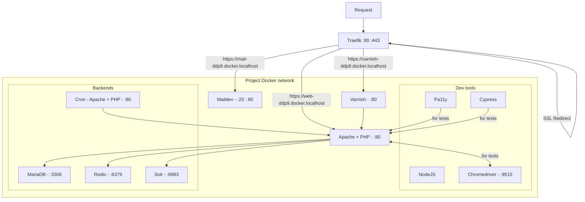

# Docker

## Overview

```mermaid
flowchart TD
  subgraph Network[Project Docker network]
    direction TB

    web[Apache + PHP - :80]
    varnish[Varnish - :80]
    mail[Maildev - :25 : 80]

    subgraph Dev[Dev tools]
        direction LR
        node[NodeJS]
        chrome[Chromedriver - :9515]
        pa11y[Pa11y]
        cypress[Cypress]
    end

    subgraph Backends
        direction LR
        mysql[MariaDB - :3306]
        redis[Redis - :6379]
        solr[Solr - :8983]
        cron[Cron - Apache + PHP - :80]
    end

  end

  Request --> traefik
  traefik[Traefik :80 :443] -- SSL Redirect--> traefik
  traefik -- https://web-ddp9.docker.localhost --> web
  traefik -- https://varnish-ddp9.docker.localhost --> varnish
  traefik -- https://mail-ddp9.docker.localhost --> mail
  cron --> web
  varnish --> web
  web --> mysql
  web --> redis
  web --> solr
  web <-- for tests --> chrome
  pa11y -- for tests --> web
  cypress -- for tests --> web
```
